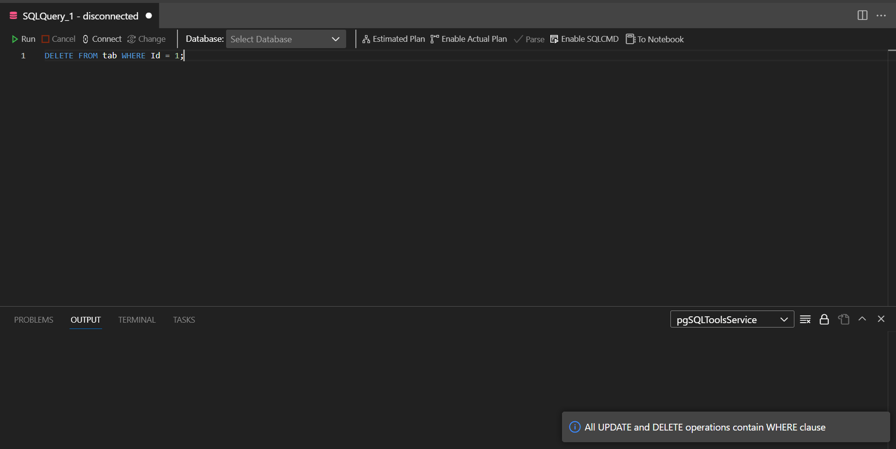
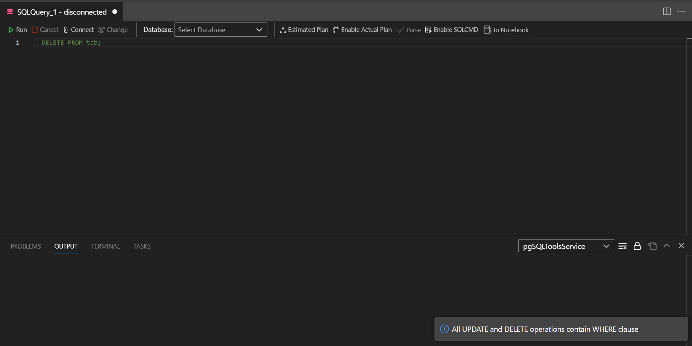
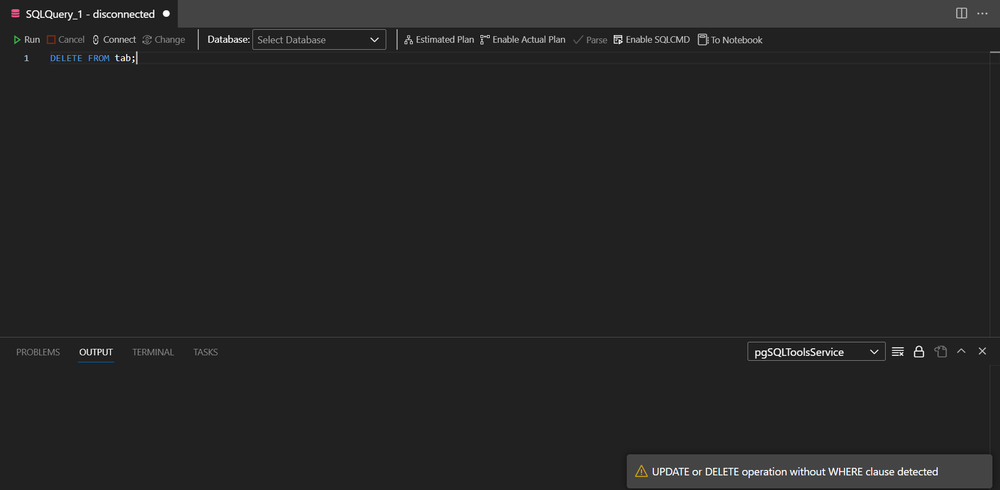

# Delete-Where

Simple Azure Data Studio extension that checks for the presence of the `WHERE` clause in `DELETE` and `UPDATE` expressions. It offers basic checking for common scenarios.

## Features

- Checks for `WHERE` presence in `DELETE` and `UPDATE` commands separated by `;`
- Skips commands that were commented out
- Can be launched via command pallete or via context menu in SQL files

* Alerts user when invalid command detected

## Examples

